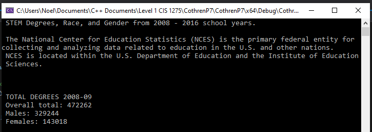

# STEM Degrees, Race, and Gender from 2008 - 2016 school years, US Universities

C++ Data Analysis Project - takes an external data file for processing, performs some statistical analysis, and displays the results in the console

Data comes from The National Center for Education Statistics (NCES). 

From their website: "NCES is the primary federal entity for collecting and analyzing data related to education in the U.S. and other nations. \n NCES is located within the U.S. Department of Education and the Institute of Education Sciences."

